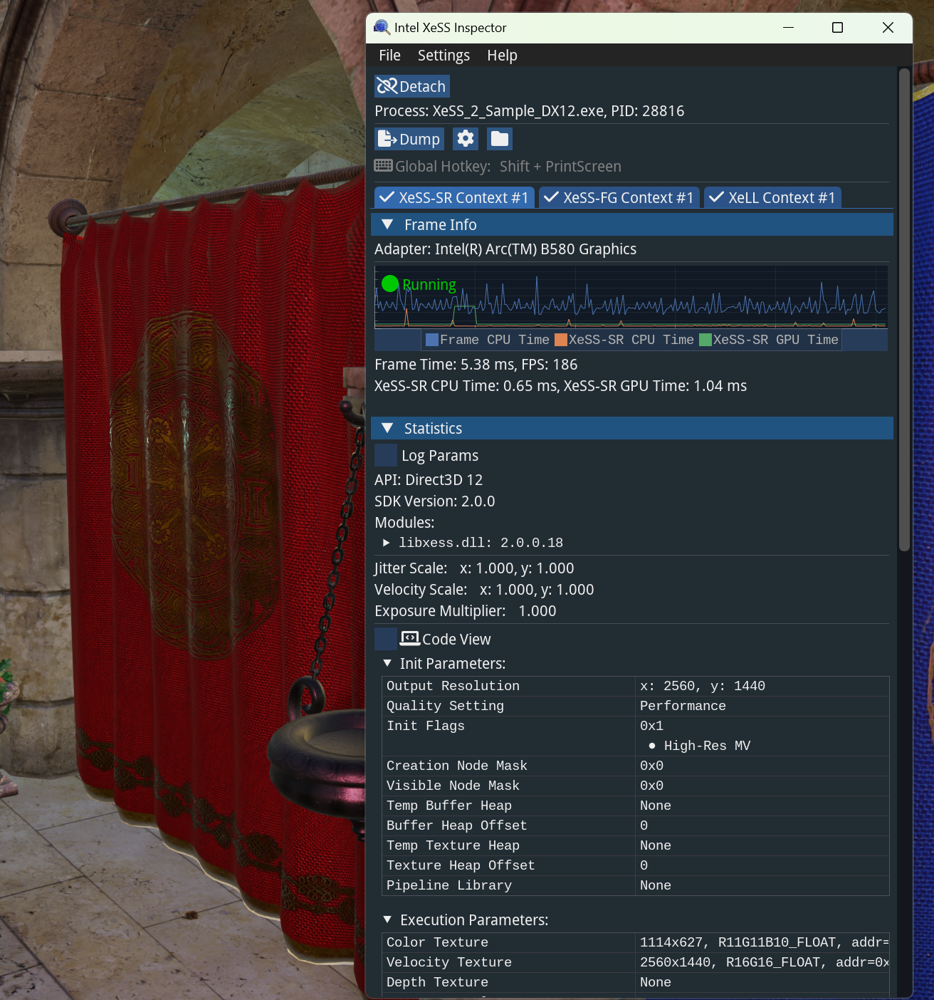

# Intel® XeSS Inspector

Intel® XeSS Inspector is a powerful debugging and validation tool designed for Intel® XeSS. It supports Intel® XeSS Super Resolution (XeSS-SR), Intel® XeSS Frame Generation (XeSS-FG), and Intel® Xe Low Latency (XeLL).

## Download

Download the latest build `v2.1.0` from the [Releases page](https://github.com/GameTechDev/XeSSInspector/releases).

## Key Features

### Context View

Intel® XeSS Inspector supports all three technologies: XeSS-SR, XeSS-FG, and XeLL. The tool groups the contexts of these technologies on the UI, with each context presented as a tab. Under each tab, detailed information and support for the respective technology are displayed.

### Real-Time State Display

Monitors XeSS state information, including initialization and execution parameters, CPU/GPU times, Sleep and Low Latency marker state of XeLL and more.

### Frame Dump

XeSS Inspector allows you to trigger the XeSS-SR and XeSS-FG frame dump features. You can dump the input and output of XeSS-SR and XeSS-FG integrations and check them offline.

### HUD Overlay

The tool enables you to visualize XeSS-SR input buffers on the target application as HUD output. You can choose different views with channels, histograms, and other controls. Different visualizations are used for different buffer types.

### State Overrides

XeSS Inspector allows you to perform quick experiments on the XeSS-SR context for debugging purposes without any code changes or API integration.

## Prerequisites

- The target application must have an XeSS 2 technology integrated (XeSS-SR, XeSS-FG or XeLL).
- The target application must not be protected by any anti-cheating or anti-debugging measures.

## Documentation

For quick start guidance and additional resources, visit [Intel® XeSS Inspector documentation](https://intel.com/xess-inspector).
